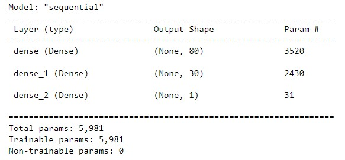

# Neural_Network_Charity_Analysis

## Overview of the analysis:
With your knowledge of machine learning and neural networks, you’ll use the features in the provided dataset to create a **deep-learning neural network** using binary classifier that is capable of predicting whether applicants will be successful if funded by Alphabet Soup.

## Data Source:
From Alphabet Soup’s business team, you received a [CSV](./Resources/charity_data.csv) containing more than 34,000 organizations that have received funding from Alphabet Soup over the years.

## Results:
* Data Preprocessing
    * What variable(s) are considered the target(s) for your model?
        * The `IS_SUCCESSFUL` column is the **target output**.
    * What variable(s) are considered to be the features for your model?
        * The variables 'APPLICATION_TYPE', 'AFFILIATION', 'CLASSIFICATION', 'USE_CASE', 'ORGANIZATION', 'STATUS', 'INCOME_AMT', 'SPECIAL_CONSIDERATIONS', and 'ASK_AMT' are considered as **features**.
    * What variable(s) are neither targets nor features, and should be removed from the input data?
        * The variable 'EIN' and 'NAME' are neither targets nor features, and should be removed from the input data.

* Compiling, Training, and Evaluating the Model
    * How many neurons, layers, and activation functions did you select for your neural network model, and why?
        * There is 3 layers for the model: (1) first layer, (2) second layer, and (3) output layer.
        * Since there are 43 input values, as the rule of thumb, We set **80** neurons in the **first layer** (i.e. 2 times the number of input values).
        * The second layer has 30 neurons, which is less than half of the first layer.
        * The output layer has 1 neuron, as usual.
        * In the first and second layer, we use the `relu` activation function to identify nonlinear characteristics from the input values.
        * For the output layer, we use `sigmoid` activation function will help us predict the probability that the applicant will be successful if funded.
        
    * Were you able to achieve the target model performance?
    * What steps did you take to try and increase model performance?

## Summary:
Summarize the overall results of the deep learning model. Include a recommendation for how a different model could solve this classification problem, and explain your recommendation.
